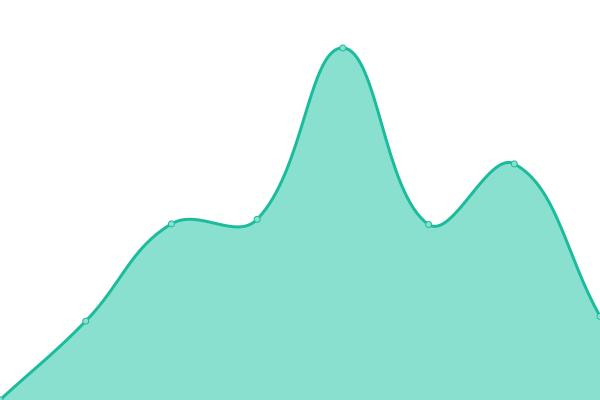
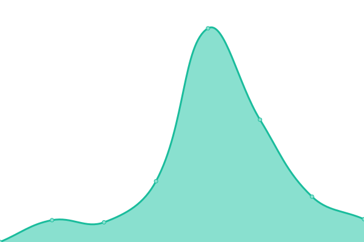

# [📈 Live Status](https://neko-casa.github.io/uptime): <!--live status--> **🟧 Partial outage**

This repository contains the open-source uptime monitor and status page for [neko.casa](https://neko-casa.github.io/uptime), powered by [Upptime](https://github.com/upptime/upptime).

With [Upptime](https://upptime.js.org), you can get your own unlimited and free uptime monitor and status page, powered entirely by a GitHub repository. We use [Issues](https://github.com/neko-casa/uptime/issues) as incident reports, [Actions](https://github.com/neko-casa/uptime/actions) as uptime monitors, and [Pages](https://neko-casa.github.io/uptime) for the status page.

<!--start: status pages-->
<!-- This summary is generated by Upptime (https://github.com/upptime/upptime) -->
<!-- Do not edit this manually, your changes will be overwritten -->
<!-- prettier-ignore -->
| URL | Status | History | Response Time | Uptime |
| --- | ------ | ------- | ------------- | ------ |
|  [mitsuha.ren](https://mitsuha.ren/) | 🟩 Up | [mitsuha-ren.yml](https://github.com/neko-casa/uptime/commits/HEAD/history/mitsuha-ren.yml) | 

 911ms
     
 | 

<a href="https://neko-casa.github.io/uptime/history/mitsuha-ren">100.00%</a>
    

|  [mitsuha.ren/blog](https://mitsuha.ren/blog/) | 🟩 Up | [mitsuha-ren-blog.yml](https://github.com/neko-casa/uptime/commits/HEAD/history/mitsuha-ren-blog.yml) | 

 246ms
     
 | 

<a href="https://neko-casa.github.io/uptime/history/mitsuha-ren-blog">100.00%</a>
    

|  [zuvia.pro](https://zuvia.pro/) | 🟩 Up | [zuvia-pro.yml](https://github.com/neko-casa/uptime/commits/HEAD/history/zuvia-pro.yml) | 

 1568ms
     
 | 

<a href="https://neko-casa.github.io/uptime/history/zuvia-pro">98.31%</a>
    

|  [zuvia.pro/disk](https://zuvia.pro/disk/) | 🟩 Up | [zuvia-pro-disk.yml](https://github.com/neko-casa/uptime/commits/HEAD/history/zuvia-pro-disk.yml) | 

 3111ms
     
 | 

<a href="https://neko-casa.github.io/uptime/history/zuvia-pro-disk">95.84%</a>
    

|  [monitoring.neko.casa](https://monitoring.neko.casa/) | 🟥 Down | [monitoring-neko-casa.yml](https://github.com/neko-casa/uptime/commits/HEAD/history/monitoring-neko-casa.yml) | 

 14793ms
     
 | 

<a href="https://neko-casa.github.io/uptime/history/monitoring-neko-casa">0.00%</a>
    

<!--end: status pages-->

[**Visit our status website →**](https://neko-casa.github.io/uptime)

## 📄 License

- Powered by: [Upptime](https://github.com/upptime/upptime)
- Code: [MIT](./LICENSE) © [neko.casa](https://neko-casa.github.io/uptime)
- Data in the `./history` directory: [Open Database License](https://opendatacommons.org/licenses/odbl/1-0/)
